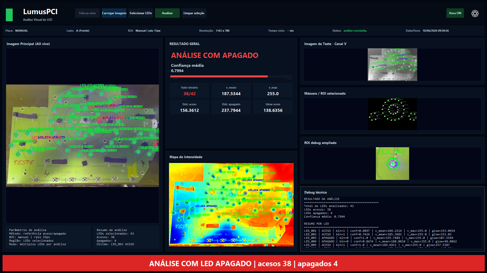

# LUMUS-PCI

Sistema em Python para **análise visual de LEDs em placas PCI**, com foco em inspeção assistida, identificação de LEDs **acesos/apagados**, visualização técnica e suporte operacional para validação de placas.

## Visão geral

O **LumusPCI** foi desenvolvido para apoiar a análise visual de placas com múltiplos LEDs, permitindo ao operador carregar imagens, selecionar LEDs, executar a análise e visualizar o resultado técnico de forma clara.

A aplicação apresenta uma interface operacional completa com:

- imagem principal da placa;
- seleção de LEDs por ROI;
- classificação de LEDs acesos e apagados;
- mapa de intensidade;
- máscara / ROI selecionado;
- debug ampliado;
- painel de resultado geral;
- resumo técnico da análise.

## Objetivo do projeto

O objetivo do projeto é reduzir a dependência de inspeção puramente manual, trazendo mais **padronização, rastreabilidade e suporte visual** para a análise de placas com LEDs.

Na prática, o sistema ajuda a:

- detectar LEDs apagados;
- visualizar regiões de interesse com mais clareza;
- apresentar métricas técnicas da análise;
- apoiar o operador durante a validação;
- facilitar futuras evoluções para análise em tempo real.

## Principais recursos

- **Carregamento de imagem** para análise
- **Seleção de LEDs** na placa
- **Análise automática** do estado dos LEDs
- **Classificação visual** entre aceso e apagado
- **Resultado geral com confiança média**
- **Canal V** para apoio à inspeção
- **Mapa de intensidade**
- **ROI debug ampliado**
- **Resumo técnico da análise**
- **Exibição de data/hora e status operacional**
- **Modo de operação preparado para uso manual e evolução futura**

## Interface do sistema

A interface foi pensada para ser funcional e técnica, concentrando em uma única tela os elementos mais importantes da análise.

### Tela principal



## Exemplo de análise

Na tela acima é possível observar:

- a **imagem principal da placa** com os LEDs identificados;
- o **resultado geral da análise**;
- a contagem de LEDs acesos e apagados;
- o **mapa de intensidade**;
- a visualização do **canal V**;
- a **máscara / ROI selecionado**;
- o **debug técnico** detalhado.

## Estrutura do projeto

A estrutura atual do projeto foi organizada para modularizar principalmente a interface, mantendo a classe pública principal da UI e preservando as regras de negócio existentes.

```bash
LUMUS-PCI/
├── assets/
├── data/
│   └── config/
├── src/
├── config.py
├── main.py
├── requirements.txt
└── estrutura_projeto.md
Organização da interface

De acordo com a documentação do projeto, a interface foi modularizada em componentes internos, mantendo src/ui/main_window.py como ponto público da UI e distribuindo responsabilidades em módulos como layout, painéis, widgets, canvas, image, updates, history e settings.

Tecnologias utilizadas
Python
Arquitetura modular da interface
Processamento visual para suporte à inspeção de LEDs
Organização por componentes para facilitar manutenção e evolução
Como executar o projeto
1. Clone o repositório
git clone https://github.com/carlosdaniel003/LUMUS-PCI.git
2. Acesse a pasta do projeto
cd LUMUS-PCI
3. Instale as dependências
pip install -r requirements.txt
4. Execute a aplicação
python main.py
Fluxo de uso
Abrir o sistema
Carregar uma imagem da placa
Selecionar os LEDs ou a região de interesse
Executar a análise
Avaliar o resultado geral
Conferir o mapa de intensidade, ROI e debug técnico
Validar a condição da placa com base no resultado
Aplicações do projeto

O LumusPCI pode ser utilizado em cenários como:

inspeção visual de PCI com LEDs;
validação de placas em bancada;
apoio à produção;
apoio à engenharia de testes;
análise assistida em processos de qualidade.
Status do projeto

Projeto em evolução, com base já funcional para:

análise manual assistida;
exibição técnica dos resultados;
refinamento de interface;
expansão futura para captura ao vivo e maior automação.
Melhorias futuras
integração mais avançada com câmera ao vivo;
persistência de histórico de análises;
relatórios exportáveis;
calibração mais refinada de thresholds;
melhorias adicionais na ergonomia visual da interface;
recursos extras de rastreabilidade.
Autor

Carlos Daniel
GitHub: carlosdaniel003

Se este projeto foi útil para você, considere deixar uma estrela no repositório.
